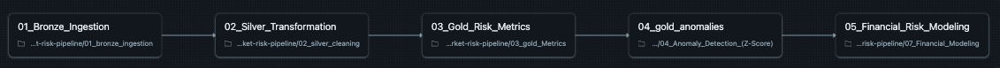
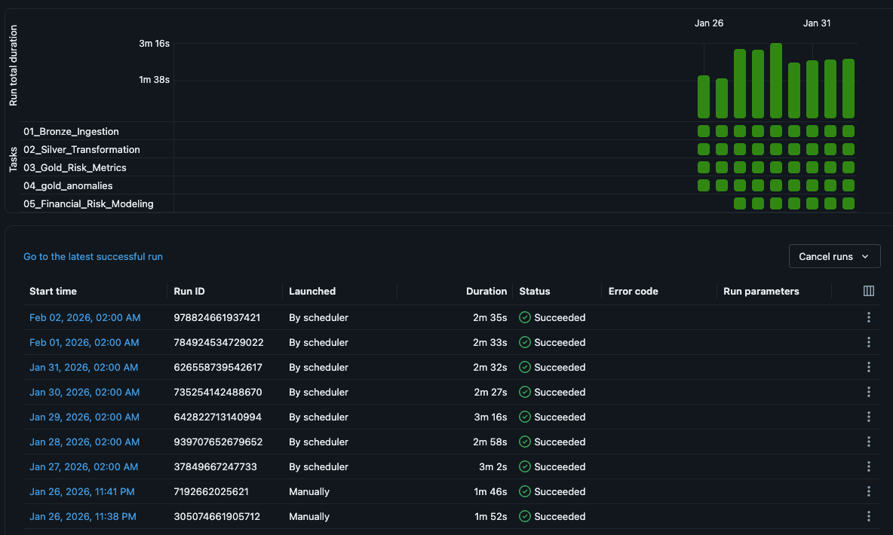
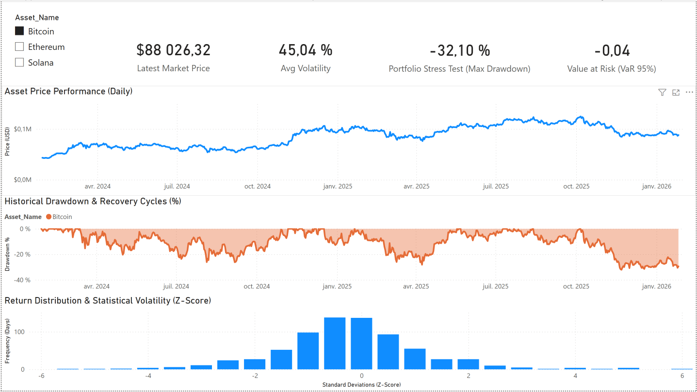
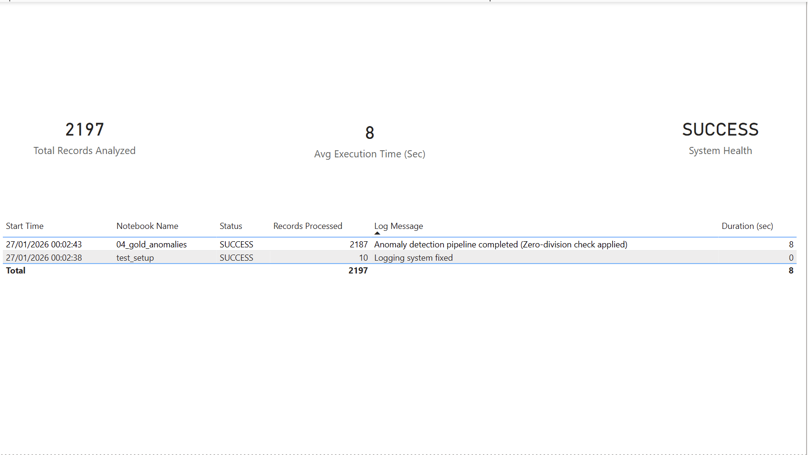

# Crypto Market Risk Pipeline


## 1. Introduction & Objectives

### 1.1 Project Vision: Real-Time Financial Monitoring & Anomaly Detection

The **Crypto Market Risk Pipeline** is a comprehensive end-to-end data platform designed to bridge the gap between **High-Performance Data Engineering** and **Advanced Financial Analytics**. 

In a market characterized by high volatility, this project serves a dual purpose:
* **Engineering Side:** Architecting a scalable and resilient data infrastructure using the **Medallion Architecture** (Bronze, Silver, Gold) on Databricks to handle automated data flows from the Coinbase API.
* **Analytical Side:** Transforming raw market data into strategic financial insights. By implementing statistical modeling—specifically **Z-Score analysis**—the pipeline identifies market anomalies and provides a deep-dive into risk metrics (Volatility, Drawdown, VaR) for assets like **BTC, ETH, and SOL**.

The ultimate goal is to move beyond simple data collection, creating a "source of truth" that empowers data-driven decision-making in the cryptocurrency space.

####  Project Structure : 

```text
crypto-market-risk-pipeline/
├── notebooks/                      # Databricks notebooks
│   ├── 00_config
│   ├── 01_bronze_ingestion
│   ├── 02_silver_cleaning
│   ├── 03_gold_metrics
│   ├── 04_anomaly_detection
│   ├── 05_sql_analytics
│   ├── 06_pipeline_monitoring
│   └── 07_financial_modeling
│
├── data/                           # Sample exported datasets
│   ├── gold_crypto_anomalies.csv
│   └── pipeline_logs.csv
│
├── docs/
│   └── images/                     # README screenshots
│
├── Crypto_Market_Risk_Analytics.pbix
├── LICENSE
└── README.md

```

### 1.2 Automation: Continuous Pipeline & Dashboard Synchronization

A core objective of this project is to eliminate manual intervention through a fully automated data lifecycle:

* **Scheduled Workflows**: The pipeline is orchestrated to run on a daily schedule, ensuring that the latest market data is ingested, processed, and analyzed every 24 hours.
* **Operational Reliability**: By integrating a dedicated monitoring layer (`06_pipeline_monitoring`), the system tracks execution health, processing times, and data volumes in real-time. This ensures that any failures in the "Bronze-to-Gold" transition are caught immediately.


This intro section bridges the gap between your high-level vision and the granular technical details of each notebook. It sets the stage for the **Medallion Architecture** you've implemented.


---


## 2. Technical Architecture: The Medallion Pipeline

The technical core of this project is built on a **Medallion Architecture** (Bronze, Silver, Gold) within the Databricks Lakehouse environment. This modular design ensures that data flows through a rigorous refinement process, transforming raw, unstructured API responses into high-integrity financial assets.

The pipeline is organized into seven specialized notebooks, each responsible for a distinct stage of the data lifecycle—balancing robust engineering with advanced financial science.

### 2.1 Notebook: 00_config (Core Configuration & Utilities)

Centralizes global parameters and shared utilities required across all notebooks, ensuring consistent configuration and robust interaction with the **Coinbase API**.

* **Centralized Configuration**: Stores API endpoints, target assets, storage paths, and pipeline-wide constants used across all stages.
* **Resilient API Requests**: Provides a custom HTTP wrapper implementing **Exponential Backoff** to safely handle Coinbase rate limits and transient network failures.
* **Incremental Loading Utilities**: Implements helper functions used to retrieve the latest available timestamp from Delta tables, enabling incremental data ingestion.
* **Unified Logging Utilities**: Defines reusable logging functions used by downstream notebooks to write execution metadata into `pipeline_logs` without embedding execution logic in the configuration layer.

---


### 2.2 Notebook: 01_ingestion_bronze (The Raw Layer)

Establishes the **Bronze Layer** as an immutable "Source of Truth" by storing raw responses from the exchange.

* **Scalable Extraction**: Implements a `generate_windows` function to chunk large historical requests into 250-day segments, preventing API timeouts.
* **Atomic Transactions**: Uses Spark’s `.mode("append")` with Delta Lake to ensure ingestion is atomic—if a batch fails, the table remains consistent.
* **Strict Schema Enforcement**: Persists data in Delta format to ensure every field (from `raw_payload` to `ingestion_batch_id`) is correctly typed.

---


### 2.3 Notebook: 02_silver_transformation (Cleaning & Deduplication)

Transforms raw Bronze data into a clean and analytics-ready **Silver Layer**, enforcing data quality, schema consistency, and record uniqueness.

* **Schema Normalization**: Parses raw API payloads into a structured tabular format and applies strict type casting, notably converting Unix timestamps into Spark timestamps to enable reliable time-series analytics.

* **Data Quality Enforcement**: Filters malformed or incomplete records and ensures critical financial fields (price, volume, timestamps) are valid before promotion to the Silver layer.

* **Robust Deduplication Logic**: Uses a **Window Function (`row_number()`)** partitioned by asset and timestamp to retain only the latest version of each market candle, ensuring uniqueness when ingestion windows overlap or batches are reprocessed.

* **Incremental Silver Updates**: The Silver table is updated incrementally by merging newly ingested data with existing records, preventing data duplication while preserving the full historical dataset.


---

### 2.4 Notebook: 03_gold_risk_metrics (Feature Engineering)

Transforms raw prices into time-series features for risk assessment.

* **Analysis: Financial Returns**: Calculates both Simple and **Logarithmic Returns** using Window Lag Functions.
* **Risk Metrics**: Computes **30-day Rolling Volatility** (`stddev`) and **Annualized Volatility** (`daily_vol * sqrt(365)`), standardizing risk comparison across assets.

### 2.5 Notebook: 04_gold_anomalies (Market Anomaly Detection)

Identifies "black swan" events by applying robust statistical models to the Gold layer.

* **Robust Z-Score**: Implements a modified scoring system to flag moves exceeding a threshold of **3.5** as anomalies:


* **Scientific Rigor**: Includes a **Zero-Division Safeguard** for stagnant markets and uses `overwriteSchema` to allow for model evolution.

### 2.6 Notebook: 05_sql_analytics (Quality Audit & Insights)

An exploratory layer using **Spark SQL** to validate output and extract historical insights.

* **Historical Stress Testing**: Identifies the **"Worst Daily Loss %"** per asset, providing historical context (e.g., SOL or ETH double-digit crashes) to the anomaly detection model.
* **Sanity Checks**: Validates asset correlations and price ranges before final delivery.

### 2.7 Notebook: 06_pipeline_monitoring (Data Observability & Health)

Dedicated to **Pipeline Reliability**, transforming metadata into actionable health insights.

* **Bottleneck Detection**: Automatically calculates the average duration of each step (`avg_duration_sec`) to identify scaling issues.
* **Real-Time Debugging**: Provides a full audit trail via `pipeline_logs`, capturing specific error messages and processing volumes (`rows_processed`).


---

### 2.8 Notebook: 07_financial_modeling (Fact & Dimension Tables)

This final stage transitions the pipeline from raw processing to a professional **Business Intelligence (BI)** structure. It focuses on high-performance analytical modeling using a **Star Schema** optimized for Power BI.

####  Data Modeling: The Star Schema Approach

To ensure optimal performance and flexibility in the dashboard, the data is restructured:

* **Fact Table (Risk Metrics)**: Stores the quantitative values (Returns, Volatility, Drawdown, VaR) indexed by `product_id` and `timestamp`.
* **Dimension Tables**: Stores descriptive metadata (Asset info, Calendar dimension), allowing for efficient slicing and dicing of the financial metrics across different timeframes and assets.

####  Quantitative Finance: Advanced Risk Metrics

This notebook implements two critical risk measures using **Window Functions** to provide a deep understanding of market downside:

* **Maximum Drawdown (MDD)**: Tracks the "pain" of an investment by measuring the largest peak-to-trough decline before a new peak is achieved.
* **Peak Calculation**: $$Peak_t = \max(Price_{0 \dots t})$$
* **Drawdown Formula**: $$Drawdown_t = \frac{Price_t - Peak_t}{Peak_t}$$


* **MDD**: The minimum value of all historical drawdowns, representing the worst-case loss scenario for a "buy and hold" strategy.


* **Historical Value at Risk (VaR 95%)**: Quantifies the potential loss of an asset with a 95% confidence level based on historical log-returns.
* **Mathematical Approach**: It identifies the 5th percentile of the return distribution.
$$VaR_{95\%} = \text{Percentile}(\text{Log Returns}, 0.05)$$


**Interpretation**: There is a 95% probability that the daily loss will not exceed this threshold. If the  is -4%, it means that in 95% of cases, the daily drop is less than 4%.


---

## 3. Orchestration & Reliability

A data pipeline is only as good as its last successful run. This project is built to be **autonomous** and **observable**, moving away from manual scripts to a production-ready workflow.

---

### 3.1 Scheduled Jobs: The Daily Pulse

The entire Medallion pipeline (from ingestion to financial modeling) is orchestrated using **Databricks Workflows**, ensuring automated and reliable execution of all processing stages.

* **Automated Workflow Execution**: A single scheduled Job triggers notebooks **01 through 07** in strict sequential order. This guarantees that downstream layers are only refreshed if upstream stages complete successfully, preserving data consistency across Bronze, Silver, and Gold tables.

* **Scheduled Execution**: The workflow runs on a daily schedule, ensuring that fresh market data is automatically ingested and processed without manual intervention.

* **Dependency Enforcement**: Notebook execution follows explicit dependencies, ensuring that stages such as **Anomaly Detection (04)** only execute after updated **Risk Metrics (03)** are successfully computed, preventing propagation of incomplete or stale data.

---

### 3.2 Operational Monitoring: System Health & Performance

To maintain reliability as data volume grows, a dedicated **Observability Layer** (Notebook 06) captures execution metrics and pipeline health indicators.

* **Throughput Monitoring**: Each pipeline run records the number of processed rows (`rows_processed`), enabling detection of silent ingestion failures where jobs succeed but produce incomplete data.

* **Performance Profiling**: Execution durations (`duration_seconds`) are recorded for every notebook, allowing identification of performance bottlenecks as workloads scale.

* **Pipeline Performance Tracking**: Aggregated metrics such as `avg_duration_sec` per notebook help monitor execution stability and detect abnormal runtime increases.

* **Error Traceability**: Failures are logged with detailed messages and execution identifiers (`run_id`) in the `pipeline_logs` table, reducing **Mean Time To Repair (MTTR)** by enabling rapid identification of failing steps.

#### Databricks Workflow Orchestration

Below is the daily scheduled workflow implemented in Databricks Workflows, showing task dependencies from Bronze ingestion to final modeling.



#### Pipeline Runs History

The pipeline is executed daily via scheduler, and run history is monitored to validate reliability and runtime stability.



Voici le **chapitre 4 final** avec les chemins d’images explicitement intégrés. Tu peux le coller tel quel dans ton README.

---

## 4. Data Visualization (Power BI)

The outputs of the data pipeline are consumed through a two-page **Power BI dashboard**, combining financial market risk analysis with technical pipeline monitoring.

The dashboard is built on the Gold analytical layer and refreshed automatically through the scheduled pipeline workflow.

---

## 4.1 Market Risk Monitoring (Page 1)

This page provides an interactive overview of crypto market risk metrics, allowing users to analyze asset performance and downside exposure.

The dashboard supports multiple assets (**Bitcoin, Ethereum, Solana**) through an asset selector.
The screenshot below illustrates the dashboard using **Bitcoin** as the selected asset.



### Key indicators

* **Latest Market Price**
  Displays the most recent closing price available in the dataset.

* **Average Volatility (30-day annualized)**
  Measures average rolling volatility, enabling comparison of risk across assets.

* **Portfolio Stress Test (Max Drawdown)**
  Shows the worst historical peak-to-trough decline observed, representing downside risk during stress periods.

* **Value at Risk (VaR 95%)**
  Estimates potential loss thresholds under normal market conditions using historical return distributions.

### Core visuals

* **Daily Price Performance**
  Time-series visualization of asset price evolution.

* **Historical Drawdown & Recovery Cycles**
  Displays downturns and recovery phases, highlighting risk exposure over time.

* **Return Distribution & Z-Score Analysis**
  Shows standardized return distribution and highlights extreme events detected as anomalies.

---

## 4.2 Data Pipeline Health Monitoring (Page 2)

The second page focuses on monitoring pipeline execution reliability and operational performance using logs generated during workflow runs.



### Operational KPIs

* **Total Records Processed**
  Number of records analyzed during the latest pipeline execution.

* **Average Execution Time**
  Average notebook execution duration in seconds.

* **System Health Status**
  Indicates whether the latest pipeline run completed successfully.

### Execution audit table

A detailed execution table provides:

* pipeline run timestamps,
* notebook execution stages,
* execution status,
* number of processed records,
* execution duration,
* execution messages.

This enables rapid identification of pipeline failures or performance degradation.


---

## 5. Analyses & Conclusions

### 5.1 Financial Risk Insights

The automated analysis successfully quantifies the distinct risk profiles of the monitored assets, moving beyond simple price tracking toward a multi-dimensional risk assessment framework.

* **Bitcoin (Benchmark Asset)**
  Bitcoin demonstrates the strongest resilience among the analyzed assets. With an **average annualized volatility of approximately 45%**, a **Maximum Drawdown near −32%**, and a **VaR (95%) around −4%**, it acts as the most stable component in the dataset. Its return distribution exhibits fewer extreme downside events, reinforcing its role as a relative anchor within the crypto ecosystem.

* **Ethereum (Moderate Risk Asset)**
  Ethereum exhibits higher exposure to market stress conditions. Its **volatility reaches approximately 67%**, while historical drawdowns exceed **−60%**, showing stronger reactions during downturns. The VaR metric also indicates larger potential daily losses compared to Bitcoin, positioning Ethereum as an intermediate risk asset.

* **Solana (High-Beta / Aggressive Asset)**
  Solana clearly emerges as the most volatile asset in the study. With **average volatility above 80%** and drawdowns approaching **−60%**, return distributions display heavier tails, meaning extreme price moves occur more frequently. This confirms Solana's higher potential returns, but with significantly increased downside exposure.

**Final Risk Hierarchy confirmed by the dashboard:**

> **BTC (Conservative) < ETH (Moderate) < SOL (Aggressive)**

This comparison demonstrates how the pipeline enables consistent cross-asset risk assessment using standardized financial metrics.

---

### 5.2 Technical Pipeline Assessment

From an engineering perspective, the project demonstrates production-oriented data engineering practices for automated financial analytics.

* **Performance & Scalability**
  The pipeline processes approximately **2,000+ records per daily run**, with an average notebook execution time close to **8 seconds**, indicating efficient ingestion and transformation stages. The architecture can be extended to support additional assets with minimal structural changes.

* **Reliability & Observability**
  The Medallion architecture combined with the monitoring layer ensures that all analytical outputs are traceable, deduplicated, and auditable. Execution logs allow rapid identification of ingestion or transformation issues.

* **Automation & Stability**
  Daily Databricks workflow executions confirm that the system operates autonomously, requiring manual intervention only in case of upstream API or logic failures.

Overall, the pipeline successfully achieves its engineering goals:

* automated ingestion and transformation,
* reproducible financial analytics,
* scalable architecture,
* operational monitoring and logging.

---

### 5.3 Future Evolutions (Next Steps)

Several extensions could further enhance the platform:

1. **Machine Learning Integration**
   A future analytical layer could integrate forecasting models (e.g., Prophet or gradient boosting approaches) to predict volatility regimes or price trends.

2. **Portfolio Optimization Module**
   Adding Mean-Variance portfolio optimization would allow computation of optimal asset allocation across BTC, ETH, and SOL based on risk-adjusted returns.

3. **Streaming Data Integration**
   A potential evolution would migrate ingestion from batch processing to structured streaming, enabling near real-time anomaly detection and monitoring.


